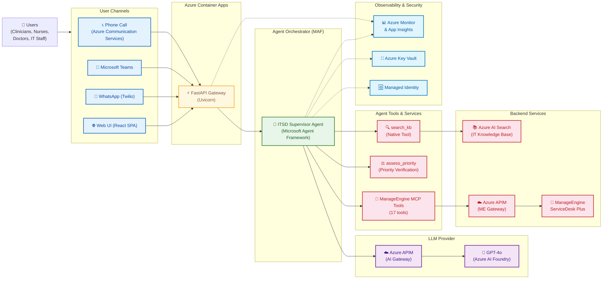

# Clinical ITSM Agent

An AI-powered IT Service Management agent for **clinical / hospital environments**. Built with the [Microsoft Agent Framework](https://github.com/microsoft/agent-framework) (Python), GPT-4o (via Azure AI Foundry), and ManageEngine ServiceDesk Plus via MCP.

## What it does

The agent acts as the **first line of IT support** for clinicians, nurses, and staff:

1. **Understands the issue** — parses natural language IT requests and asks clarifying questions
2. **Searches the knowledge base first** — looks up troubleshooting guides and FAQs before creating tickets
3. **Creates and manages tickets intelligently** — classifies priority, category, and resolver group using the hospital's ITSM taxonomy
4. **Escalates with full context** — when self-service fails, creates a ticket with conversation summary so human resolvers can pick up seamlessly
5. **Routes non-IT requests** — directs HR, Facilities, and Operations questions to the right contact

## Architecture



### Data Flow

1. User contacts via any channel (Phone, Teams, WhatsApp, Web UI) → hits **FastAPI gateway** on Azure Container Apps
2. Gateway routes to the **ITSD Supervisor Agent** (Microsoft Agent Framework)
3. Agent calls **GPT-4o** through **Azure AI Foundry** for reasoning
4. Agent uses `search_kb` → **Azure AI Search** to find KB articles first (KB-first triage)
5. Only if KB fails → Agent loads the `ticket-creation` **skill** on-demand (categories, groups, business rules)
6. Agent calls `assess_priority` for deterministic multi-signal priority scoring (user input × impact/urgency matrix × text analysis)
7. Agent uses MCP tools → **APIM** → **ManageEngine ServiceDesk Plus** to create/manage tickets with verified priority
8. All calls instrumented via **Azure Monitor & App Insights**

> **Skills (progressive disclosure):** Business rules, categories, and resolver groups are loaded on-demand via MAF `SkillsProvider` — only when the agent needs to create or manage tickets. KB-only queries skip loading skills entirely, saving ~800 tokens per request.

## Project structure

```
clinical-itsm-agent/
├── agent.py              ← Agent definition (slim prompt, tools, skills, MCP)
├── server.py             ← FastAPI server (/chat, /health, tools_used tracking)
├── config.py             ← Settings (reads from .env)
├── pyproject.toml        ← Dependencies
├── kb/
│   ├── search.py         ← search_kb @tool (Azure AI Search, semantic search)
│   ├── priority.py       ← assess_priority @tool (multi-signal priority verification)
│   ├── index_kb.py       ← Indexer script (Excel → Azure AI Search)
│   ├── solutions_kb.xlsx ← 33 IT knowledge base articles
│   └── README.md         ← KB docs
├── skills/                ← MAF Skills (loaded on-demand, saves tokens)
│   ├── ticket-creation/
│   │   ├── SKILL.md       ← Ticket creation workflow + mandatory fields
│   │   └── references/
│   │       ├── categories.md       ← ManageEngine categories
│   │       ├── resolver-groups.md  ← Support group routing
│   │       └── business-rules.md   ← Clinical business rules
│   ├── ticket-management/
│   │   └── SKILL.md       ← Check status, add notes, update, list tickets
│   └── non-it-routing/
│       └── SKILL.md       ← HR/Facilities/Operations contacts
├── mock_mcp/
│   ├── __init__.py
│   └── server.py         ← Mock ManageEngine MCP server (17 tools)
├── frontend/             ← React chat UI
│   ├── src/
│   └── package.json
├── infra/                ← Azure Bicep (AI Search, Key Vault, Monitoring)
└── tests/
```

## Quick start

### Prerequisites

- Python 3.11+
- Azure CLI logged in (`az login`) with access to:
  - LLM endpoint (Core42 Compass via APIM, or Azure AI Foundry for dev)
  - Azure AI Search (with `itsd-kb` index populated)

### Setup

```bash
git clone https://github.com/hamza-roujdami/ccad-itsd-agent.git
cd clinical-itsm-agent
python3 -m venv .venv
source .venv/bin/activate
pip install -e ".[dev,mock]"
```

### Configure

Copy `.env.example` to `.env` and fill in your Azure endpoints:

```bash
cp .env.example .env
```

```env
FOUNDRY_PROJECT_ENDPOINT=https://<your-ai-services>.cognitiveservices.azure.com/
FOUNDRY_MODEL=gpt-4o
AZURE_SEARCH_ENDPOINT=https://<your-search>.search.windows.net
AZURE_SEARCH_INDEX_NAME=itsd-kb
MCP_SERVER_URL=http://localhost:8001/mcp
```

### Index the knowledge base

Populate the Azure AI Search index with the 33 KB articles:

```bash
python -m kb.index_kb
```

### Run (local development)

Terminal 1 — start the mock MCP server (ManageEngine substitute):

```bash
python -m mock_mcp.server
```

Terminal 2 — start the agent API:

```bash
python server.py
```

Terminal 3 — start the chat UI:

```bash
cd frontend
npm install
REACT_APP_API_URL=http://localhost:8000 npm start
```

Open **http://localhost:3000** in your browser.

### Test via UI

The chat UI shows which tool was used for each response:

- **Clinical Knowledge Base** — answered from KB articles (no ticket created)
- **Clinical ManageEngine** — ticket created/read/updated via ManageEngine MCP
- **Clinical_ITSM_AGENT** — no tools used (greetings, clarifying questions, non-IT routing)

Try these prompts:

```
How do I reset my password?                    → KB answer, no ticket
My laptop screen is cracked                    → asks clarifying questions
Epic is down for the whole department          → creates urgent ticket
How do I apply for annual leave?               → redirects to HR
Can you check the status of ticket 32203?      → reads ticket from ManageEngine
```

### Test via curl

```bash
# Health check
curl http://localhost:8000/health

# Chat — KB question (no ticket created)
curl -X POST http://localhost:8000/chat \
  -H "Content-Type: application/json" \
  -d '{"message": "How do I reset my password?"}'

# Chat — Issue requiring ticket
curl -X POST http://localhost:8000/chat \
  -H "Content-Type: application/json" \
  -d '{"message": "Epic Hyperspace is down for the entire cardiology department"}'
```

## Tech stack

| Component | Technology |
|-----------|-----------|
| Agent Framework | [Microsoft Agent Framework](https://github.com/microsoft/agent-framework) (Python) v1.3.0 |
| MAF: Agent | `Agent` — single-agent with tools and context providers |
| MAF: MCP Client | `MCPStreamableHTTPTool` — connects to ManageEngine MCP server via HTTP |
| MAF: Skills | `SkillsProvider` — progressive disclosure of business rules via `SKILL.md` files |
| MAF: LLM Client | `FoundryChatClient` — connects to GPT-4o via Azure AI Foundry |
| MAF: History | `CosmosHistoryProvider` (prod) / `FileHistoryProvider` (dev) — persistent conversation history |
| LLM | GPT-4o via Azure AI Foundry |
| Knowledge Base | Azure AI Search (semantic search, 33 KB articles) |
| Ticketing | ManageEngine ServiceDesk Plus via MCP (APIM gateway, 17 tools) |
| Conversation Store | Azure Cosmos DB NoSQL (serverless) — falls back to local JSON files |
| API | FastAPI + Uvicorn |
| Auth | Azure Identity (`DefaultAzureCredential`) |
| Infra | Bicep (`infra/`) |

## API

### `POST /chat`

```json
{
  "message": "My printer is not working",
  "session_id": "optional-for-multi-turn"
}
```

Response:
```json
{
  "reply": "I found some troubleshooting steps...",
  "session_id": "uuid"
}
```

### `GET /health`

Returns `{"status": "ok"}`.

## KB content

33 articles covering: Cisco Phone, Printing, Epic, Passwords, VPN, VDI, MFA, MS Teams, Intune, PowerMic, Email, Monitors, and more. See [`data/README.md`](data/README.md).

## Related

- `infra/` — Azure infrastructure (Bicep): Foundry Account + Project, GPT-4o, text-embedding-3-large, AI Search, Key Vault, Monitoring
- `factory-code/` — Factory development team implementation (separate approach)
- `references/` — Cloned reference repos (gitignored)
