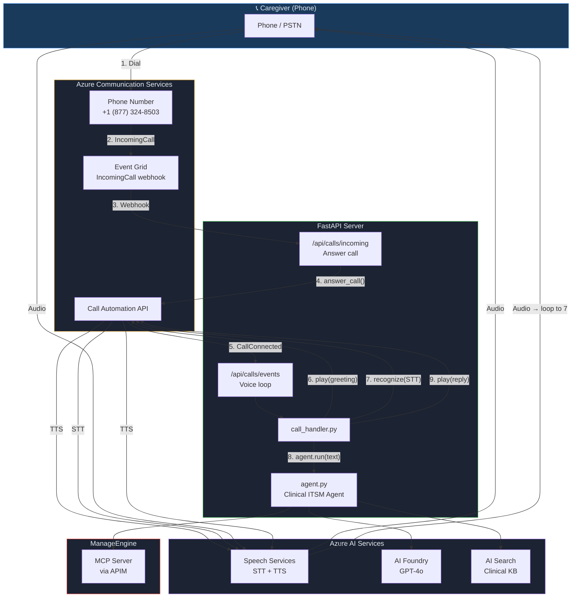
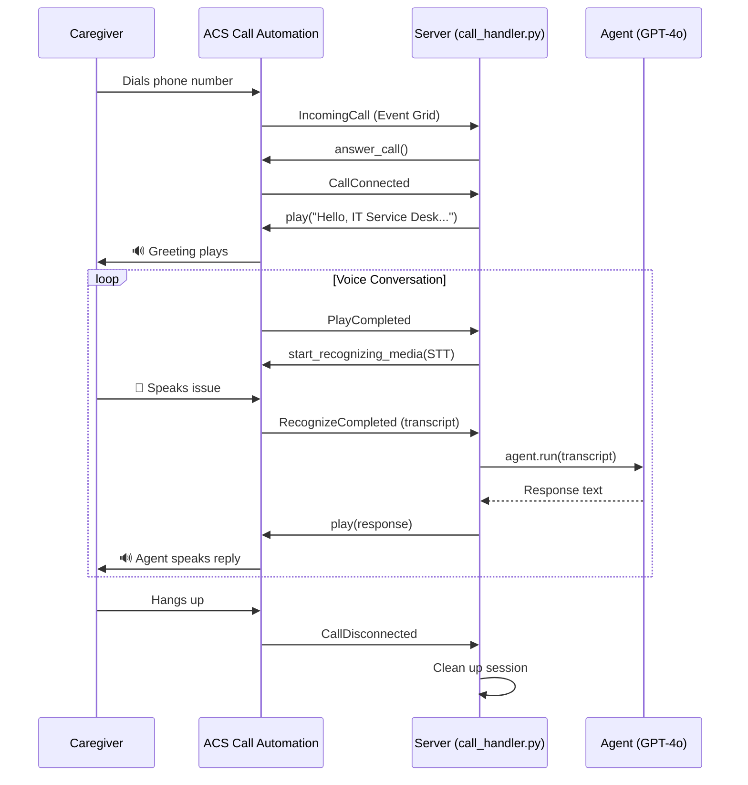

# Voice Channel — ACS Telephony Integration

Caregivers can call a phone number and speak directly to the Clinical IT Service Desk Agent. The agent answers, listens to the issue, searches the knowledge base, creates tickets, and speaks the response — all over a regular phone call.

## Architecture



## Voice Loop



## How It Works

### Call Flow

1. **Caregiver dials** the ACS phone number (+1-877-324-8503)
2. **ACS receives** the PSTN call and fires an `IncomingCall` event via Event Grid
3. **Server answers** the call via Call Automation SDK (`answer_call`)
4. **Greeting plays** via TTS: *"Hello, IT Service Desk. How can I help you today?"*
5. **STT listens** for the caller's speech (10s silence timeout)
6. **Agent processes** the transcript — same GPT-4o agent with KB search, clinical triage, ticket creation
7. **TTS plays** the agent's response back to the caller
8. **Loop repeats** from step 5 until the caller hangs up

### Key Files

| File | Purpose |
|------|---------|
| `call_handler.py` | Voice loop logic: answer, greet, recognize, agent, play, repeat |
| `server.py` | FastAPI routes: `/api/calls/incoming` + `/api/calls/events` |
| `config.py` | ACS connection string, callback URL, cognitive services endpoint |
| `infra/modules/communication-services.bicep` | ACS resource provisioning |

### Configuration

Add these to `.env`:

```env
# Azure Communication Services
ACS_CONNECTION_STRING=endpoint=https://acs-xxx.communication.azure.com/;accesskey=...
ACS_CALLBACK_BASE_URL=https://your-public-url.example.com
ACS_COGNITIVE_SERVICES_ENDPOINT=https://your-ai-services.cognitiveservices.azure.com/
```

### Prerequisites

1. **ACS resource** with a PSTN phone number (toll-free or geographic)
2. **Event Grid subscription** on the ACS resource routing `IncomingCall` events to `{ACS_CALLBACK_BASE_URL}/api/calls/incoming`
3. **AI Services resource** (same one used for Foundry/GPT-4o) — ACS uses it for STT/TTS
4. **RBAC**: ACS managed identity needs `Cognitive Services User` role on the AI Services resource
5. **Public URL** for webhooks — dev tunnel for local dev, real URL for production

### Azure Resources

| Resource | Purpose | Auth |
|----------|---------|------|
| Azure Communication Services | PSTN telephony + Call Automation | Connection string |
| Azure AI Services (Foundry) | GPT-4o (agent LLM) + Speech (STT/TTS) | Entra ID (Managed Identity) |
| Azure AI Search | Clinical knowledge base | Entra ID |
| Event Grid | Route incoming calls to server | Managed by ACS |
| ManageEngine (via APIM) | Ticket creation/management | APIM subscription key |

### Local Development

```bash
# 1. Start mock MCP server
.venv/bin/python -m mock_mcp.server &

# 2. Start the agent server
.venv/bin/python server.py

# 3. Expose port 8000 publicly (for ACS webhooks)
#    Option A: VS Code port forwarding (Ports tab → Forward 8000 → set Public)
#    Option B: ngrok http 8000

# 4. Update .env with the public URL
#    ACS_CALLBACK_BASE_URL=https://your-tunnel-url

# 5. Call the phone number to test
```
