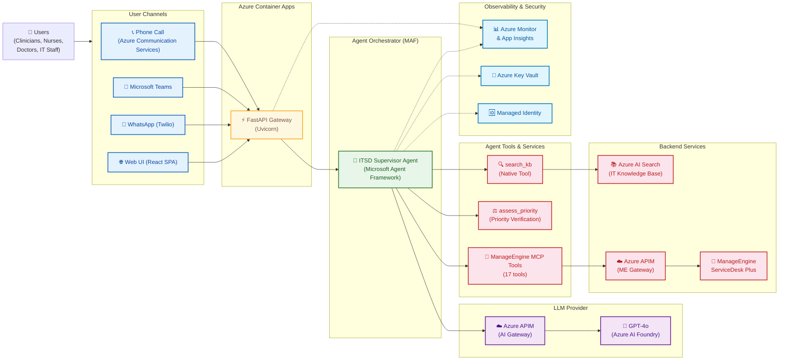
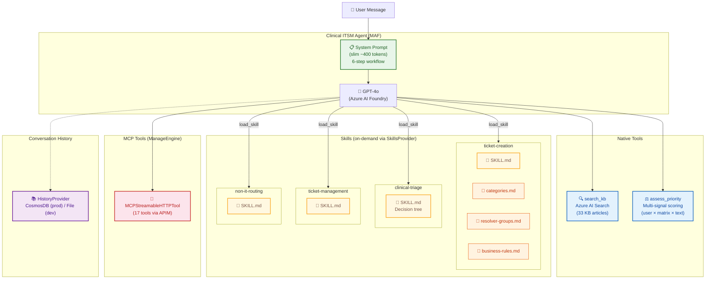

# Architecture

## Solution Overview

The Clinical ITSM Agent is an AI-powered IT Service Desk agent for hospital/clinical environments.
It uses the Microsoft Agent Framework (MAF) with a single-agent architecture, progressive skill
disclosure, and MCP integration with ManageEngine ServiceDesk Plus.

## Infrastructure View

## Agent Internals

## Key Design Decisions

| Decision | Choice | Rationale |
|---|---|---|
| Single agent vs multi-agent | Single agent | ITSM scope is sequential (KB → ticket), not parallel. 1 LLM call vs 2. |
| Skills vs hardcoded prompts | MAF SkillsProvider | Business rules loaded on-demand. KB-only queries save ~800 tokens. |
| MCP vs direct API | MCP for ManageEngine | Customer owns MCP server. Agent auto-discovers 17 tools. Decoupled. |
| Native tool vs MCP for KB search | Native `search_kb` | Tightly coupled to our Azure AI Search config. No MCP overhead. |
| Priority scoring | Deterministic `assess_priority` tool | Weighted vote (user × matrix × text analysis). Not LLM-interpreted. |
| Conversation persistence | CosmosDB (prod) / File (dev) | MAF built-in `HistoryProvider`. Zero custom code. |
| Observability | OpenTelemetry → App Insights | MAF `configure_otel_providers()`. Agents (Preview) view in portal. |

## Azure Resources

| Resource | Purpose | Bicep Module |
|---|---|---|
| Azure AI Foundry | GPT-4o model hosting | `infra/modules/ai-foundry.bicep` |
| Azure AI Search | KB index (33 articles) | `infra/modules/ai-search.bicep` |
| Azure Cosmos DB | Conversation history (serverless) | `infra/modules/cosmos-db.bicep` |
| Azure Key Vault | Secrets management | `infra/modules/key-vault.bicep` |
| Azure Monitor + App Insights | Telemetry, agent tracing | `infra/modules/monitoring.bicep` |
| Azure Communication Services | Voice channel (Phase 2) | `infra/modules/communication-services.bicep` |
